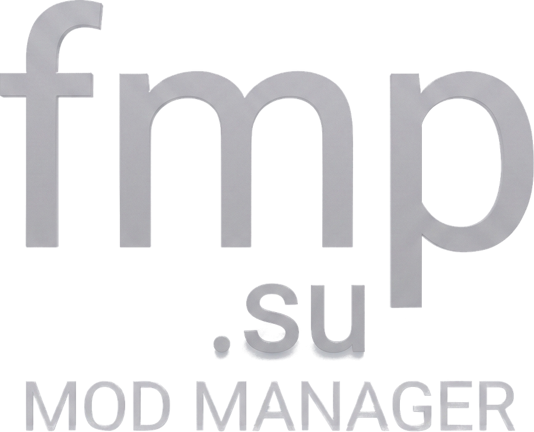
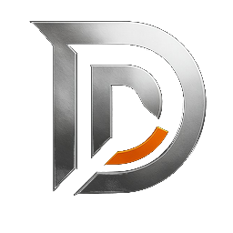

# TOOLS

Source for Sami's desktop tools. Each app below has its own release channel — click a badge to grab the latest installer, no GitHub account needed.

| | App | | |
|---|---|---|---|
|  | **CHUB Mod Manager** Mod manager for Dead by Daylight |  |
|  | **FMP Mod Manager** Mod manager for Dead by Daylight |  |
|  | **Diddler** Send/cancel Dead by Daylight friend requests when the in-game system won't cooperate |  |
|  | **LaunchPad X** Universal launch pad for trainers, spoofers, bypasses and unlockers |  |

## Installing

Click a badge above, then download the `.exe` from that app's latest release page and run it.

Windows SmartScreen may show an "unrecognized publisher" warning on first run since these aren't code-signed — click **More info → Run anyway**.

## Updating

Every app checks its own release channel from inside its settings — no need to come back here. Click **Check for updates** in the app, and it'll download and offer to install anything newer on its own.
